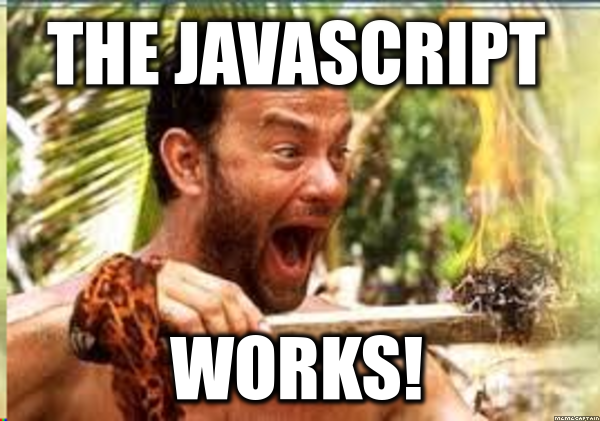

# Bristol Javascript 101 Meetup Handbook

## Welcome!

:fire: Let's help you get started with everything you need to know about the group and keeping up to date with Javascript.

This is the index for all the resources we use...

[Meetup](https://www.gitbook.com/book/javascript101/guide/edit#) - our main Meetup.com page

[Chat](https://www.gitbook.com/book/javascript101/guide/edit#) - our Gitter chat page

[Discussion](https://www.gitbook.com/book/javascript101/guide/edit#) - Katja puts Meetup discussion notes here

[Wiki](https://github.com/CodeHubOrg/organisations-database/wiki)  \[do we want to migrate this into this handbook???\]

[Projects](https://www.gitbook.com/book/javascript101/guide/edit#) - Github repos for projects and sessions

[Presentations](https://www.gitbook.com/book/javascript101/guide/edit#) - Past meetup presentations

[Knowledgebase](https://www.gitbook.com/book/javascript101/guide/edit#) - Q&A

## Contributing

:heart: If you have any feedback or would like to contribute please let us know [here](https://gitter.im/CodeHubOrg/discussions).

