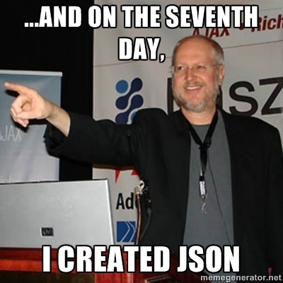

# Data Sources

* [JSON](http://www.json.org/)
* NoSQL - [MongoDB](https://www.mongodb.com/) - FCC teaches Mongo as their database.
* [Local Storage](https://www.smashingmagazine.com/2010/10/local-storage-and-how-to-use-it/)
* ReThink DB
* Reddis
* REST API
* JS-Data

LocalStorage can be used as a stepping stone into databases. Stores data persistently \(or per session\) in the browser in a format like a javascript object. You 'stringify' the object before storing in LocalStorage, as LocalStorage can only store strings, and de-stringify or parse back to an object when you read from LocalStorage to convert back into an object.

MongoDB is a 'document' type database; it uses JSON style data objects, so will feel familiar to working with javascript objects. Taught by FreeCodeCamp.

SQL type databases, like PostgreSQL. The traditional style of database with tables and SQL.

